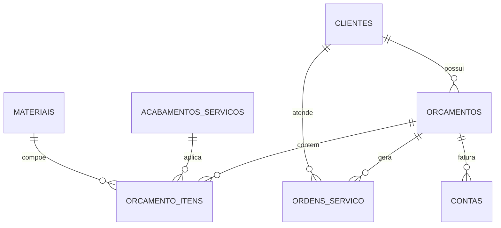

# 🏛️ ERP Marmoraria (Cross-Platform Windows Desktop & Android APK)

Sistema corporativo completo e moderno para gestão de marmorarias, medições técnicas de obras, cálculo de orçamentos com fator de perda, controle de chão de fábrica via Kanban, emissão de propostas comerciais em **PDF A4**, disparo direto via **WhatsApp** e fluxo de caixa financeiro com persistência local em **SQLite**.

---

## 🌟 Funcionalidades Implementadas

### 1. 📊 Dashboard Gerencial
- **Indicadores em Tempo Real (KPIs)**:
  - Total de orçamentos emitidos no mês e faturamento projetado.
  - Pedidos em produção ativa na fábrica.
  - Entregas e instalações previstas para os próximos 7 dias.
  - Saldo financeiro a receber e a pagar pendentes.
- **Ações Rápidas**: Acesso com 1 clique para "Novo Orçamento", "Nova Medição / OS" e "Novo Cliente".
- Lista de ordens ativas com badges de status coloridos.

### 2. 🧮 Calculadora & Gestão de Orçamentos
- **Seleção Ágil**: Associação imediata ao cliente/obra ou cadastro instantâneo via modal.
- **Fórmula de Metragem Quadrada Real**:
  $$\text{m}^2 = \text{largura} \times \text{comprimento} \times \text{quantidade} \times \left(1 + \frac{\text{perda}\%}{100}\right)$$
- **Adição Dinâmica de Ambientes**: Cozinha Principal, Ilha / Bancada Seca, Lavabo Social, Banho Master, Área Gourmet, Soleiras e Nichos.
- **Acabamentos Lineares & Unitários**:
  - Cortes em 45º (Meia Esquadria com saia).
  - Bisotê, Boleado Duplo e Reto com Polimento.
  - Furos para Cuba Embutida/Sobrepor e Cooktop.
  - Cubas esculpidas com válvula oculta.
- **Exportação & Integração**:
  - 📄 **Proposta em PDF A4**: Layout profissional pronto para impressão ou envio com cabeçalho da marmoraria, dados do cliente, tabela milimétrica de peças, totais e linhas de assinatura.
  - 📲 **WhatsApp Direto**: Geração de mensagem formatada enviada via API `wa.me` para o smartphone do cliente.
  - ⚡ **Automação de Aprovação**: Ao marcar o orçamento como *Aprovado*, o sistema cria automaticamente a Ordem de Produção no Kanban e a Conta a Receber no Financeiro.

### 3. 🏭 Chão de Fábrica & Kanban Interativo (5 Etapas)
- Fluxo contínuo de produção:
  1. 📏 **Medição Agendada** (Visita técnica ao canteiro de obras)
  2. 🪚 **Corte** (Serragem das chapas de granito/mármore)
  3. ✨ **Acabamento** (Polimento, colagem de 45º, furos de cuba)
  4. 🚚 **Montagem / Instalação** (Fixação e colagem no cliente)
  5. 🏁 **Concluído**
- **Arrastar e Soltar (Drag and Drop)**: Arraste os cartões de serviço entre as colunas para atualizar a fase de produção no SQLite.
- Botão de avanço rápido de fase com 1 toque.

### 4. 👥 Controle de Clientes & Obras
- Cadastro completo de Pessoa Física (PF) e Pessoa Jurídica (PJ) com CNPJ/CPF.
- Busca em tempo real por nome, telefone, documento ou cidade.
- Acesso rápido para chamada ou mensagem no WhatsApp.

### 5. 💎 Catálogo de Materiais, Pedras & Acabamentos
- **Rochas & Chapas**: Granitos (São Gabriel, Itaúnas, Ubatuba, Corumbá), Mármores (Travertino Nacional, Carrara), Superfícies Nobres (Quartzo Stellar, Branco Prime, Dekton).
- Gestão de custos, preços de venda por m² e margem de lucro calculada.
- Tabela de valores por metro linear ou unidade para cada acabamento.

### 6. 📅 Agenda de Medições & Entregas
- Acompanhamento cronológico de visitas na obra e montagens agendadas.
- Alertas para compromissos marcados para **Hoje** ou com **Atraso**.

### 7. 💵 Fluxo de Caixa & Financeiro
- Gestão de Contas a Receber (entradas de orçamentos) e Contas a Pagar (discos de corte, insumos, despesas).
- Quitação/recebimento rápido com 1 toque.
- Visão do saldo consolidado previsto.

---

## 🗄️ Modelagem do Banco de Dados SQLite

O sistema gerencia 7 tabelas normalizadas com relacionamentos de chave estrangeira (`PRAGMA foreign_keys = ON`) criadas automaticamente na primeira execução com rotina `CREATE TABLE IF NOT EXISTS`:



### Localização do Arquivo de Dados (`marmoraria.db`):
- **No Windows Desktop**: Salvo em `%LOCALAPPDATA%\erp_marmoraria\marmoraria.db` (acesso isolado e seguro no perfil do usuário).
- **No Android**: Salvo no sandbox interno do aplicativo através de `getDatabasesPath()`.

---

## 💻 Como Executar e Compilar

### Pré-requisitos
- **Flutter SDK** (instalado em `C:\src\flutter\bin` ou no seu PATH).
- Para compilar no Windows: **Visual Studio Community** com C++ Desktop Development.
- Para compilar no Android: **Android SDK** ou **Android Studio**.

---

### 1. Executar em Modo Desenvolvimento

#### No Windows (Desktop):
```powershell
flutter run -d windows
```

#### No Android (Emulador ou Dispositivo Físico via USB):
```bash
flutter run -d android
```

#### No Navegador Web (Chrome / Edge):
```bash
flutter run -d chrome
```

---

### 2. Gerar o Executável Nativo Windows (.exe)

Para gerar a compilação final otimizada para Windows:

```powershell
flutter build windows --release
```

O executável e suas dependências serão gerados na pasta:
```
build\windows\x64\runner\Release\
├── erp_marmoraria.exe
├── flutter_windows.dll
└── data/
```
> Basta compactar a pasta `Release` ou criar um instalador (ex: Inno Setup) para distribuir em computadores Windows.

---

### 3. Gerar o Instalador Android (APK)

Para gerar o arquivo `.apk` pronto para instalar em celulares ou tablets Android:

```bash
flutter build apk --release
```

Ou para gerar APKs otimizados por arquitetura (menor tamanho de download):
```bash
flutter build apk --split-per-abi
```

O arquivo gerado estará disponível em:
```
build\app\outputs\flutter-apk\app-release.apk
```
> Transfira o arquivo `app-release.apk` para o smartphone Android e toque nele para instalar diretamente.

---

## 🧪 Testes Automatizados

O projeto conta com suíte de testes unitários e de integração de ponta a ponta com banco SQLite em memória:

```bash
flutter test
```

Validação de tipagem e integridade estática:
```bash
flutter analyze
```

---

## 📁 Estrutura do Código-Fonte

```
erp_marmoraria/
├── lib/
│   ├── main.dart                          # Inicialização FFI SQLite e Provider
│   ├── core/
│   │   ├── constants/
│   │   │   ├── app_colors.dart            # Paleta visual ardósia, granito e âmbar
│   │   │   └── app_theme.dart             # Tema Material 3 Light/Dark
│   │   └── utils/
│   │       ├── formatters.dart            # BRL Moeda (R$), Datas e m²
│   │       └── responsive.dart            # Detecção de telas Desktop / Mobile
│   ├── database/
│   │   ├── database_helper.dart           # FFI SQLite Windows & Nativo Android
│   │   └── initial_data.dart              # Carga inicial de rochas e acabamentos
│   ├── models/                            # 7 Modelos das tabelas do SQLite
│   │   ├── cliente_model.dart
│   │   ├── material_model.dart
│   │   ├── acabamento_model.dart
│   │   ├── orcamento_model.dart
│   │   ├── orcamento_item_model.dart
│   │   ├── ordem_servico_model.dart
│   │   └── conta_model.dart
│   ├── services/
│   │   ├── database_service.dart          # Camada de consultas, transações e métricas
│   │   ├── pdf_service.dart               # Emissão de propostas comerciais em PDF A4
│   │   └── whatsapp_service.dart          # Formatação e disparo para WhatsApp
│   ├── providers/                         # Gerenciamento de estado reativo
│   │   ├── app_provider.dart
│   │   ├── orcamento_provider.dart
│   │   ├── producao_provider.dart
│   │   └── financeiro_provider.dart
│   └── views/                             # Telas do sistema
│       ├── layout/
│       │   └── main_layout.dart           # Sidebar Desktop / Drawer Android
│       ├── dashboard/
│       │   └── dashboard_view.dart
│       ├── orcamento/
│       │   ├── orcamentos_list_view.dart
│       │   ├── calculadora_view.dart
│       │   └── widgets/
│       │       └── orcamento_item_dialog.dart
│       ├── producao/
│       │   ├── kanban_view.dart
│       │   └── widgets/
│       │       └── os_dialog.dart
│       ├── clientes/
│       │   ├── clientes_view.dart
│       │   └── cliente_form_dialog.dart
│       ├── catalogo/
│       │   ├── catalogo_view.dart
│       │   ├── material_form_dialog.dart
│       │   └── acabamento_form_dialog.dart
│       ├── agenda/
│       │   └── agenda_view.dart
│       └── financeiro/
│           ├── financeiro_view.dart
│           └── conta_form_dialog.dart
├── test/
│   ├── widget_test.dart                   # Testes das fórmulas de m² e perda
│   └── database_test.dart                 # Testes de integração com SQLite FFI
├── windows/                               # Runner nativo C++ Windows Desktop
├── android/                               # Runner nativo Kotlin/Gradle Android
└── pubspec.yaml                           # Dependências e metadados
```
